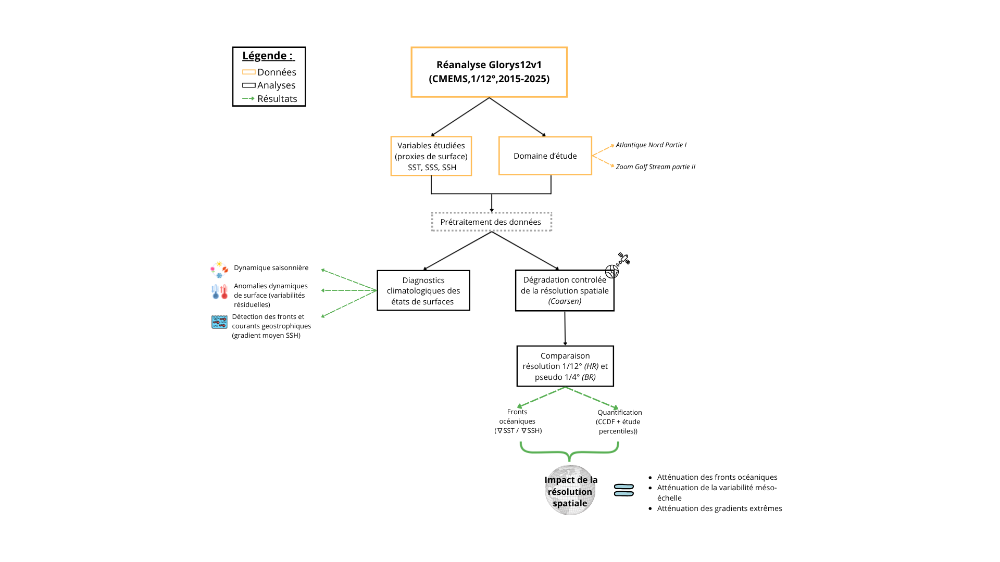
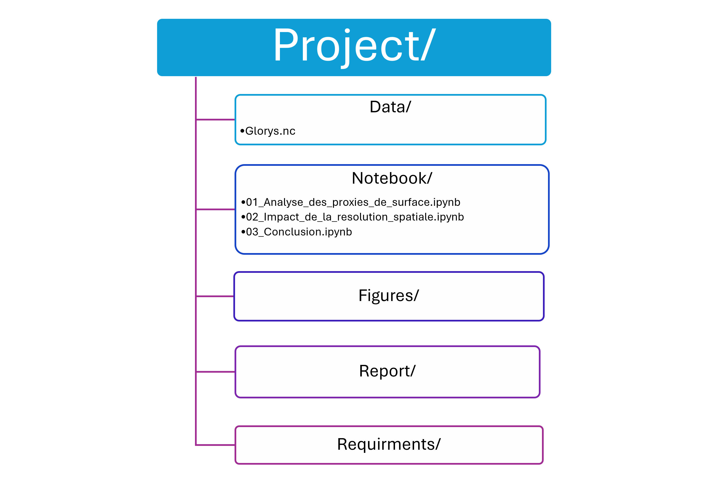

# Diagnostic de surface du Gulf Stream : une première approche pour comprendre les effets de la résolution spatiale dans les études sur l'AMOC 

## A propos du projet 
Ce projet exploratoire a été réalisé de manière autonome afin de me familiariser avec cette problématique scientifique et de mettre en oeuvre une démarche scientifique d’analyse de données océanographiques à partir de la réanalyse GLORYS12V1. Il constitue également une démonstration de compétences en traitement de données NetCDF, en programmation Python (Xarray, NumPy, Pandas, Matplotlib) et en analyse scientifique.

## Contexte 
L’Atlantic Meridional Overturning Circulation (AMOC) est un système majeur de courants océaniques qui redistribue la chaleur, le sel et les masses d’eau à l’échelle de l’Atlantique. Sa représentation dans les modèles numériques dépend fortement de la résolution spatiale, qui conditionne la capacité à représenter les fronts océaniques et les structures de méso-échelle, rendant leur identification, leur caractérisation et leur suivi plus difficiles.

## Objectifs
Ce projet vise à repondre à la problematique suivante : **Que révèlent les proxies de surface SST, SSS et SSH sur les structures de circulation de l’Atlantique Nord, et dans quelle mesure la résolution spatiale influence-t-elle leur représentation dans la région du Gulf Stream ?**

Pour répondre à cette problématique, l’étude s’articule autour de trois questions :
- Dans quelle mesure une diminution de la résolution spatiale atténue-t-elle les fronts océaniques ?
- La variabilité de méso-échelle est-elle correctement représentée à plus basse résolution ?
- Quel est l’impact de la résolution sur la fréquence des gradients de surface les plus intenses ?

## Organisation du projet

Ce schéma présente la démarche scientifique suivie dans ce projet, depuis le prétraitement des données GLORYS12V1 jusqu’à l’évaluation de l’impact de la résolution spatiale sur la représentation du Gulf Stream. Les méthodes, les résultats et les analyses détaillés sont présentés dans le rapport scientifique cf. *"report/"*.

## Méthode
1. Acquisition des données:
  - Réanalyse océanographique GLORYS12V1 (Copernicus Marine).
  - Variables étudiées : SST, SSS et SSH.
  - Domaine : 80°W-0°E ; 30°N-70°N.
  - Période : janvier 2015 - janvier 2025.
  - Données mensuelles au format NetCDF.

2. Prétraitement :
  - Ouverture et manipulation des données avec Xarray.
  - Sélection du domaine d’étude pour la seconde partie sur le Gulf Stream (80°W-40°W ; 30°N-50°N.).
  -  Calcul des moyennes mensuelles et des diagnostics dérivés.
  -  Detérioration d’un modéle "High Resolution" en "Low Resolution" pseudo 1/4° par agrégation spatiale *(coarsen)* afin d’isoler l’effet de la résolution.

3. Analyse des proxies de surface
  - Cartographie de l’état moyen en été et hiver boréal.
  - Cartographie de l’amplitude saisonnière.
  - Cartographie de la variabilité résiduelle (apres retrait de la variailité saisonnière)
  - Cartographie des gradients horizontaux SSH afin d’identifier les fronts océaniques.

4. Analyse statistique
  - Cartographie du 95e percentile des gradients SST et SSH en haute et basse résolution.
  - Calcul des percentiles (P50, P75, P90, P95, P99) des gradients SST et SSH en haute et basse résolution.
  - Calcul d'une fonction de distribution cumulative complémentaire (CCDF) des gradients SST afin de quantifier les événements extrêmes.
  - Comparaison quantitative entre les deux résolutions.

Ces analyses ont été réalisées sous python, les bibliothèques utilisées sont répertoriées dans le fichier *"requirements"*. 
L'ensemble des codes ainsi qu'une analyse concise, sont également disponibles dans les notebooks du fichier *"notebooks"*. 

## Structure du Github 
Le projet est organisé de manière à séparer les données, les notebooks, les figures et le rapport scientifique afin de faciliter la compréhension projet.

  

>**RMQ:**
>Le projet ne contient pas de partie data en raison de leur volume important, Elles sont disponible gratuitement sur le portail Copernicus Marine et peuvent être téléchargées en suivant les paramètres decrits dans *Méthode*.

## Rapport scientifique 
Un rapport scientifique est disponible *(au format PDF)* dans le dossier "report/". Il présente en détail le contexte de l'étude, la méthodologie, les analyses réalisées, les résultats obtenus ainsi que les limites et les perspectives du projet.

## Résultats 

  Les résultat montre que la diminution de résolution préserve les structures de grande échelle, mais atténue progressivement les fronts océaniques, les gradients les plus intenses et la variabilité des structures méso-échelle. Ces résultats soulignent l'importance d'une résolution élevée pour représenter fidèlement les structures fines de l'Atlantique Nord et améliorer la fiabilité des diagnostics de surface utilisés dans les études sur l'AMOC.
  
## Limites et perspectives  

**Les limites :**
  - La basse résolution est obtenue par lissage spatial de la réanalyse GLORYS 1/12° et non à partir d'une simulation native à 1/4°. 
  - L'étude se limite aux variables de surface (SST, SSS et SSH), utilisées comme proxys de la circulation océanique. 
  - Les analyses restent descriptives et n'identifient pas directement les mécanismes physiques en jeu.
    
**Les perspectives :**
  - Étendre l'analyse à la structure tridimensionnelle de l'AMOC. 
  - Quantifier l'influence de la résolution sur les transports de chaleur, de sel et de masse. 
  - Approfondir l'étude de la résolution sur la dynamique de méso-échelle (tourbillons, méandres, énergie cinétique turbulente) et de son influence sur les fronts océaniques.

